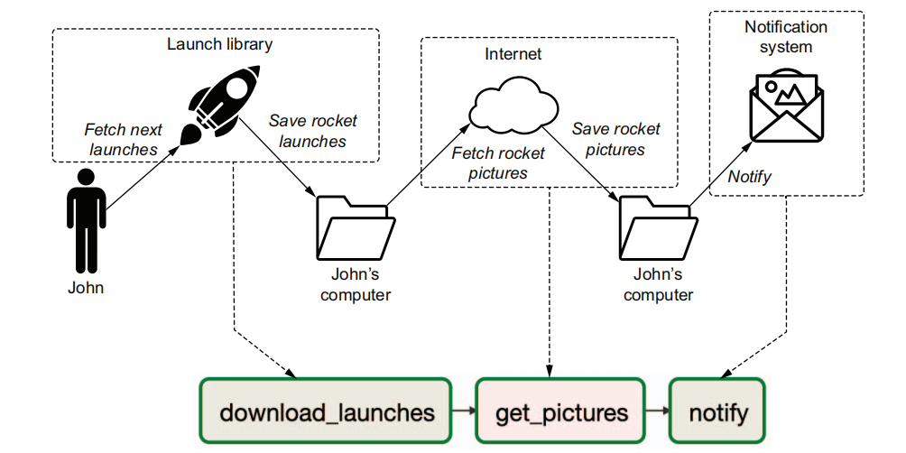

# Rocket Launches

## About
Project created to learn basic concepts about Airflow. **Attention**: The idea of project and all code were taken out from book https://www.amazon.com.br/Data-Pipelines-Apache-Airflow-Harenslak/dp/1617296902

## Project
Project to help John who needs tracks and follows every single rocket launch. The news about rocket
launches is found in many news sources that John keeps track of, and, ideally, John would like to have all his rocket news aggregated in a single location.

### Data Source
For the data, we make use of the Launch Library 2 (https://thespacedevs.com/llapi) online repository of data about both historical and future rocket launches from various sources.

### Airflow DAG


### How to run 
* Install [Docker](https://docs.docker.com/engine/install/ubuntu/)
* Run Airflow in Docker
```
docker run \
 -ti \ 
 -p 8080:8080 \
 -v /path/to/dag/download_rocket_launches.py:/opt/airflow/dags/download_rocket_launches.py \
 --entrypoint=/bin/bash \
 --name airflow \
apache/airflow:2.0.0-python3.8 \ 
 -c '( \
airflow db init && \ 
airflow users create --username admin --password admin --firstname Anonymous --lastname Admin --role Admin
 --email admin@example.org \ 
); \
airflow webserver & \ 
airflow scheduler \
'
```
change /path/to/dag for your path

* View Airflow on http://localhost:8080
* Log in with "admin" and password "admin"
* Run Download_rocket_launches DAG
* Move images from container to local host
```
docker cp airflow:/tmp/images/electron_image_20190705175640.jpeg $(pwd)
```